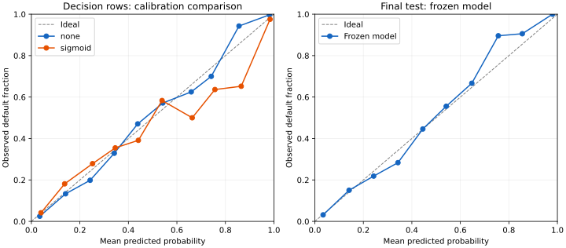

# Phase 4 evaluation report

Run: `models/selected-v1`. Protocol fixed before search: [selection protocol](selection_protocol.md).
Machine-readable evidence: [selection results](selection_results.json).

## Data and protocol

Input SHA-256: `a0a7ff1fe7f28c7ac03e35124aca01735d23df53a51b51bc5393859665257767`.

Original grouped split preserved: 22,811 training, 4,889 validation, 4,874 test rows.
The validation partition became 2,449 calibration rows and 2,440 decision rows.
Five grouped folds used only the original training partition. Each fold fitted
fresh feature engineering/preprocessing and its estimator. Weight ratios were
calculated from fold-training labels. Identical inputs, including conflicting
labels, remained together in all partitions and folds.

CV means below are selection evidence, not unbiased post-tuning estimates.
Sample standard deviation uses ddof=1. Threshold metrics use 0.5.

## Cross-validation comparison

| Candidate | roc_auc | pr_auc | f1 | precision | recall | log_loss | brier_score |
|---|---:|---:|---:|---:|---:|---:|---:|
| logistic_regression-unweighted | 0.852981 ± 0.005298 | 0.681958 ± 0.005549 | 0.576209 ± 0.009347 | 0.732484 ± 0.007074 | 0.475071 ± 0.013662 | 0.363913 ± 0.004927 | 0.112144 ± 0.001770 |
| logistic_regression-weighted | 0.853307 ± 0.005600 | 0.677273 ± 0.006349 | 0.603157 ± 0.010675 | 0.494241 ± 0.010173 | 0.773720 ± 0.012595 | 0.469628 ± 0.006675 | 0.153698 ± 0.002598 |
| random_forest-unweighted | 0.913195 ± 0.005239 | 0.851078 ± 0.006693 | 0.774367 ± 0.009795 | 0.930118 ± 0.003677 | 0.663385 ± 0.013829 | 0.275142 ± 0.018638 | 0.071250 ± 0.001843 |
| random_forest-weighted | 0.913696 ± 0.006020 | 0.849695 ± 0.007165 | 0.769994 ± 0.007817 | 0.839569 ± 0.010532 | 0.711209 ± 0.012406 | 0.279946 ± 0.004043 | 0.078755 ± 0.001572 |
| xgboost-unweighted | 0.916899 ± 0.003530 | 0.851053 ± 0.006280 | 0.762395 ± 0.008564 | 0.930846 ± 0.005987 | 0.645707 ± 0.013791 | 0.253292 ± 0.005758 | 0.072337 ± 0.002140 |
| xgboost-weighted | 0.916518 ± 0.003322 | 0.848345 ± 0.006103 | 0.718707 ± 0.010729 | 0.666863 ± 0.007606 | 0.779338 ± 0.015703 | 0.332389 ± 0.003197 | 0.101158 ± 0.001528 |
| xgboost-trial-6 | 0.933849 ± 0.002454 | 0.879323 ± 0.004382 | 0.797599 ± 0.009328 | 0.937214 ± 0.011737 | 0.694332 ± 0.013522 | 0.219225 ± 0.004191 | 0.062187 ± 0.001639 |

## Tuning and choice

Twelve sequential TPE trials used seed 42, five startup trials and the fixed
search space in the protocol. Every trial used the same five grouped folds.
Trial details and fold metrics are retained in the JSON evidence.

Selected candidate: **xgboost-trial-6**. It had the highest mean ROC-AUC;
the other model families fell outside the predeclared 0.002 AUC tolerance.
Its lower CV log loss and Brier score also support this choice despite its
greater complexity than Logistic Regression. Random Forest was not forced out
by an XGBoost-only selection rule.

XGBoost: 200 trees, depth 5, learning rate 0.1407256738281049,
min_child_weight=1, scale_pos_weight=1, hist, seed 42, one CPU thread.
No early stopping; other resolved parameters are in the JSON evidence.

## Feature availability review

Keep the nine raw fields and three derived ratios. Exclude loan_grade because
source timing and derivation remain unverified. Retain loan_int_rate only for
the declared priced-offer demo, accepting explicit missing values. This review
does not establish pre-pricing validity or resolve upstream provenance gaps.

## Calibration and threshold

The selected base estimator fitted only the original training rows. A sigmoid
calibrator fitted only calibration rows. The separate decision rows compared
no calibration against sigmoid; no calibration won on the predeclared log-loss
criterion, with better Brier score too. Calibration was evaluated, not assumed
necessary. Reliability curves still show sampling noise and residual error.

| Decision metric at 0.5 | None | Sigmoid |
|---|---:|---:|
| log_loss | 0.201327 | 0.208473 |
| brier_score | 0.056903 | 0.058168 |

Selected threshold: **0.43**, maximizing demo F1 on the fixed
0.05..0.95 grid; ties prefer precision then the higher threshold. The full grid
is retained. This is not a lending-cost policy and does not change display
risk-score bands. Decision metrics are optimistic selection metrics.

## Frozen final test evaluation

Frozen at `2026-09-09T22:13:21.887223+00:00`; evaluated at `2026-09-09T22:14:35.815077+00:00`.
Input, artifact, sidecar and selection evidence were verified before scoring.
The final test was scored once after all decisions were frozen. No refit or
post-test model/feature/calibration/threshold changes were made.

| Test metric | Value |
|---|---:|
| roc_auc | 0.940042 |
| pr_auc | 0.884125 |
| f1 | 0.798310 |
| precision | 0.909747 |
| recall | 0.711195 |
| log_loss | 0.212963 |
| brier_score | 0.061381 |

Confusion matrix (rows = actual, columns = predicted; labels 0, 1):

| | Predicted 0 | Predicted 1 |
|---|---:|---:|
| Actual 0 | 3736 | 75 |
| Actual 1 | 307 | 756 |

## Artifact and reproduction

`models/selected-v1/model.joblib` contains raw-input feature engineering,
preprocessing and the fitted XGBoost estimator. No calibrator was selected.
`model.json` records runtime, dataset/feature version, decision metrics,
calibration and threshold. `frozen.json` binds the hashes and exact partitions.
`test.json` is separate; metadata metrics remain explicitly decision metrics.

Use the locked Python 3.12 environment. To reproduce development selection,
choose a fresh output directory with `scripts/train_model.py --output ...`.
Read the saved final test report instead of scoring test again. The CLI marker
prevents accidental repetition within a run, not deliberate changes or a new
checkout. Future research must disclose that test results are now known.

## Limitations and remaining product work

No temporal validation, verified population/horizon, entity identifiers,
fairness audit or real-lending validation. Grouping cannot identify different
records belonging to one person. Historical EDA used the full dataset.
The small tuning budget does not exhaust possible models. Probability metrics
and reliability plots do not prove calibration under deployment shift.
SHAP (Phase 5) and operational API/database serving (Phase 6) remain pending.
