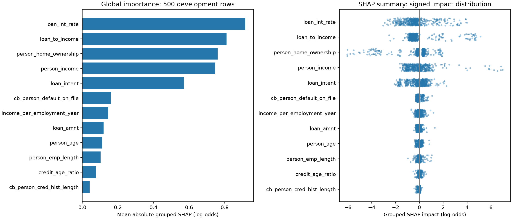
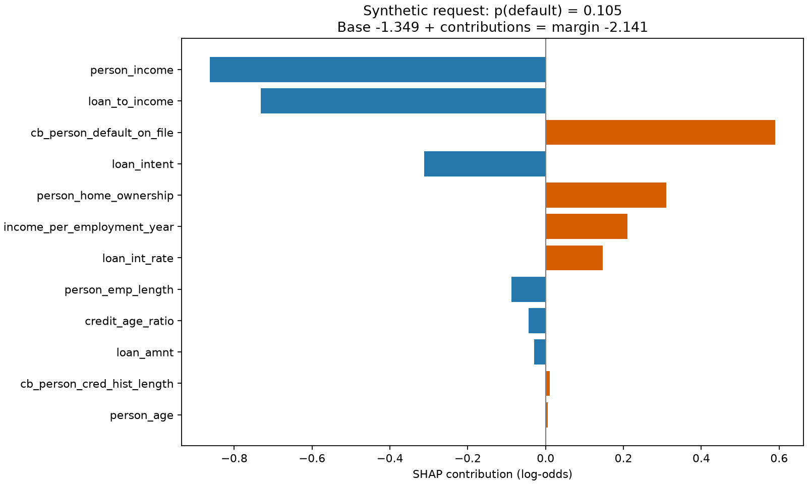

# Phase 5 explainability

The frozen `selected-v1` uncalibrated XGBoost pipeline is explained with
`shap.TreeExplainer(model_output="raw", feature_perturbation="tree_path_dependent")`.
No training, calibration, threshold change or final-test scoring occurs.

## Meaning and aggregation

Values are natural log-odds for default class 1. `base_value + sum(contributions)`
reconstructs `output_value`; applying sigmoid reconstructs the pipeline probability.
Positive impacts raise the model output relative to its base, negative impacts
lower it, and zero impacts are neutral. These are not probability percentage points.
The base uses training path counts stored in the trees, not a new background sample.
It is not the population default rate or necessarily its logit.

The API returns all 12 grouped impacts, ordered by absolute magnitude. Numeric
features, including the three derived ratios, remain separate. One-hot impacts
are summed by their source categorical field, including inactive categories.
This preserves additivity but does not recompute SHAP with source fields as
coalition players. Correlated and derived variables share information; their
attributions are not causal effects or independently actionable recommendations.
Feature names use the source/derived schema in the data dictionary.

Calibrated wrappers and other estimators are explicitly rejected. The explanation
therefore describes the actual uncalibrated model selected in Phase 4. A future
calibrated model requires an explicit explanation contract update.

## Verified development evidence

A seed-42 sample of 500 rows from the saved decision partition was explained on
2026-09-10. No test rows were used. Exact sample positions, artifact and dataset
hashes are in [the results](explanation_results.json).
Maximum reconstruction error: 0.00000607 log-odds.
Global importance is mean(abs(grouped signed impact)); it describes this sample,
not the full population. The summary uses horizontal impact and vertical jitter
only; color does not encode original feature values.

The local example is explicitly synthetic. Employment duration and interest rate
are null and pass through the fitted imputers. Its predicted probability is
0.105213, with base -1.349089 and final raw margin -2.140599.

## API contract

`explanation` is now an object with `base_value`, `output_value`,
`output_space="log_odds"`, `method="tree_path_dependent"`,
`explains="uncalibrated_model"` and `contributions`.
Each contribution has `feature`, signed `impact` and `direction`
(`positive`, `negative` or `neutral`). This replaces the unreleased list-only
scaffold. The ORM JSONB field stores the same complete object. The service passes
the same loaded pipeline to prediction and explanation.

SHAP and its service mapping are implemented; operational PostgreSQL migrations,
transaction tests and full serving remain Phase 6 work.

## Reproduction

Install the optional plotting dependencies with `uv sync --locked --extra dev --extra viz`.
Run `uv run --locked python scripts/explain_model.py` from the repository root.
Use `--output models/explanations-v2` for another run; existing outputs are rejected.
The script verifies the frozen artifact and input hashes and uses decision rows only.
The saved selected-model artifact is needed locally; it is not bundled in Git.

The locked SHAP/Matplotlib combination emits pending deprecation warnings for
colormap setters. They are upstream warnings and are not suppressed.

Reference: [SHAP TreeExplainer](https://shap.readthedocs.io/en/stable/generated/shap.TreeExplainer.html).
